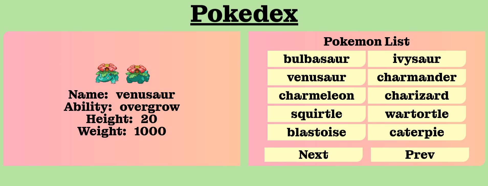

# Pokedex Nextjs

# Build with

- Nextjs v.12
- Tailwindcss native animations and effects
- Montagu Slab google fonts

# Install

- Clone the repository
- `npm install`
- `npm run dev`
- open browser and add URL `localhost:3000`

